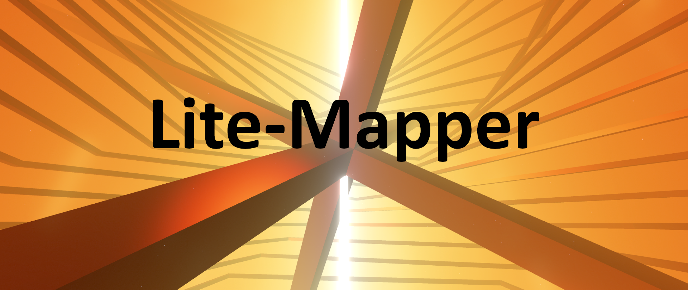

# Lite-Mapper

Lite-Mapper is a lightweight, library to aid in the creation of V3 Beat Saber maps. Lite-Mapper provides basic support for the creation of various objects for Beat Saber maps. This includes modded elements for [Chroma and Noodle Extensions](https://github.com/Aeroluna/Heck).

## How to use it

Lite-Mapper runs on [Deno](https://deno.com/), so you will need to download it to run Lite-Mapper. You will also need the Deno extension for VSCode to properly utilise the features of Deno.

To use Lite-Mapper, download the `Lite-Mapper.zip` folder in the [latest release](https://github.com/Aureliona1/Lite-Mapper/releases/latest), then extract the zip into your map folder. From there, simply open the folder in VSCode (or your favourite code editor) and add some stuff to `script.ts`.
Then, open the command palette with `Ctrl + Shift + P`, or `Cmd + Shift + P` on mac, and type `Deno: Initialize Workspace Configuration` and press yes for anything that it asks.

To run Lite-Mapper, simply open the `run.bat` file and let it do its thing. `run.bat` relies on [denon](https://github.com/denosaurs/denon#denoland), so you will need to install this to use `run.bat`.

**Important**
For mac and ChromeBook users, `run.bat` probably won't work. In this case, open a new terminal (for VSCode, go `Terminal > New Terminal`), then type `deno run --allow-all script.ts`.

## Documentation

To read about what kind of things to put in your script.ts, head over to the [docs](docs.md) page.
